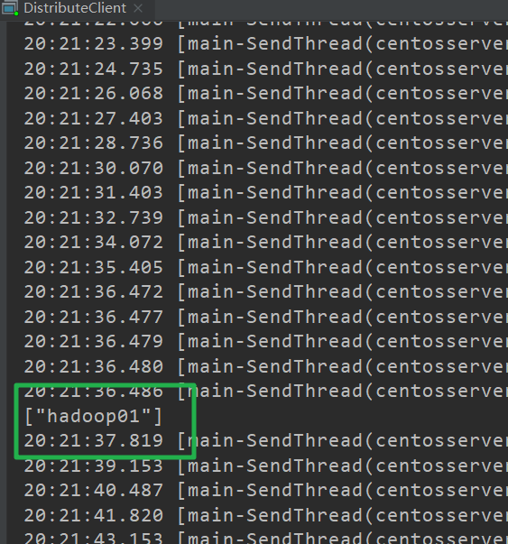
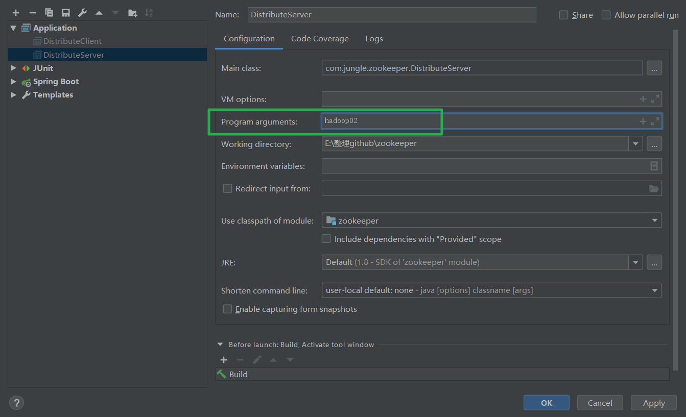

zookeeper

# ZooKeeper的数据模型


计算机其实就是用来处理或存储数据的，运行在它上面的软件大都也是如此。zookeeper作为多进程的协调者，肯定是跑不了了。

存储数据和摆放物品是一样的，不能随意乱扔，这样既占地方，又不好看，也难寻找。所以必须得有一定的层次结构。这就是计算机的专业课数据结构了。

最简单的数据结构就是数组或链表了。它们被称为线性表，是一维的，具有线性关系，即前后顺序，优点是简单，缺点是功能不够强大。

然后就是树了，可以认为它是两维的，左右是兄弟关系，上下是父子关系，因此具有从属关系。它是一个功能与复杂度兼顾的结构。现实生活中的各类组织架构大都是树形的。

再复杂的就是图了，它是网状结构，可以认为是多维的，由于任何节点都可以连通，因此它表达一种多边关系。虽功能强大但也很复杂。现实中的铁路网和人际关系网大都是网状的。

当然，这是三大类数据结构，每一类中又可以分为很多种。比如树就有很多种变体，虽然都叫树，但有的差别还是很大的。

ZooKeeper选择了树作为自己存储数据的结构，其实它和文件系统也非常相似，如下图：


谈到数据就离不开增、删、改、查，对应树来说，增就是添加新的节点到树中，删就是从树中删除某个节点，改就是修改树中某个节点上存放的数据，查就是找到树中某个节点读取它上面存放的数据。

说白了就是树形表示的是一种结构，真正的数据是在节点上放着呢，叶子节点或非叶子节点都可以。

---


# API应用

## 创建项目


----

## 添加pom文件

```xml
<dependency>
            <groupId>junit</groupId>
            <artifactId>junit</artifactId>
            <version>RELEASE</version>
        </dependency>
        <dependency>
            <groupId>org.apache.logging.log4j</groupId>
            <artifactId>log4j-core</artifactId>
            <version>2.8.2</version>
        </dependency>
        <!-- https://mvnrepository.com/artifact/org.apache.zookeeper/zookeeper -->
        <dependency>
            <groupId>org.apache.zookeeper</groupId>
            <artifactId>zookeeper</artifactId>
            <version>3.4.5-cdh5.7.0</version>
        </dependency>
```

---

## 添加日志设置

  需要在项目的src/main/resources目录下，新建一个文件，命名为“log4j.properties”，在文件中填入

```properties
log4j.rootLogger=INFO, stdout
log4j.appender.stdout=org.apache.log4j.ConsoleAppender
log4j.appender.stdout.layout=org.apache.log4j.PatternLayout
log4j.appender.stdout.layout.ConversionPattern=%d %p [%c] - %m%n
log4j.appender.logfile=org.apache.log4j.FileAppender
log4j.appender.logfile.File=target/spring.log
log4j.appender.logfile.layout=org.apache.log4j.PatternLayout
log4j.appender.logfile.layout.ConversionPattern=%d %p [%c] - %m%n
```


---

## 获取子节点并监听节点变化

```java
/**
	 * 创建ZooKeeper客户端
	 * @throws IOException
	 */
	@Before
	public void init() throws IOException {

		zkClient = new ZooKeeper(connectString, sessionTimeout, new Watcher() {

			@Override
			public void process(WatchedEvent event) {

				System.out.println("---------start----------");
				List<String> children;
				try {
					children = zkClient.getChildren("/", true);

					for (String child : children) {
						System.out.println(child);
					}
					System.out.println("---------end----------");
				} catch (KeeperException e) {
					// TODO Auto-generated catch block
					e.printStackTrace();
				} catch (InterruptedException e) {
					// TODO Auto-generated catch block
					e.printStackTrace();
				}
			}
		});
	}
	
	/**
	 * 2 获取子节点 并监控节点的变化
	 * @throws Exception
	 */
	@Test
	public void getChildren() throws Exception {

		//true 表示设置为监听
		List<String> children = zkClient.getChildren("/", true);

		for (String child : children) {
			System.out.println(child);
		}

		// 延时阻塞
		// 保持程序不停止
		// 目的:节点变换，及时反映
		Thread.sleep(Long.MAX_VALUE);
	}
```


---

## 完整程序

--TestZookeeper

```java
package com.jungle.zookeeper;

import java.io.IOException;
import java.util.List;

import org.apache.zookeeper.CreateMode;
import org.apache.zookeeper.KeeperException;
import org.apache.zookeeper.WatchedEvent;
import org.apache.zookeeper.Watcher;
import org.apache.zookeeper.ZooDefs.Ids;
import org.apache.zookeeper.ZooKeeper;
import org.apache.zookeeper.data.Stat;
import org.junit.Before;
import org.junit.Test;

public class TestZookeeper {

	private String connectString = "192.168.1.18:2181";
	private int sessionTimeout = 2000;
	private ZooKeeper zkClient;

	/**
	 * 创建ZooKeeper客户端
	 * @throws IOException
	 */
	@Before
	public void init() throws IOException {

		zkClient = new ZooKeeper(connectString, sessionTimeout, new Watcher() {

			@Override
			public void process(WatchedEvent event) {
//
//				System.out.println("---------start----------");
//				List<String> children;
//				try {
//					children = zkClient.getChildren("/", true);
//
//					for (String child : children) {
//						System.out.println(child);
//					}
//					System.out.println("---------end----------");
//				} catch (KeeperException e) {
//					// TODO Auto-generated catch block
//					e.printStackTrace();
//				} catch (InterruptedException e) {
//					// TODO Auto-generated catch block
//					e.printStackTrace();
//				}
			}
		});
	}

	/**
	 * 1.创建子节点
	 * @throws Exception
	 */
	@Test
	public void create() throws Exception {

		// 参数1：要创建的节点的路径； 参数2：节点数据 ； 参数3：节点权限 ；参数4：节点的类型
		String nodeCreated = zkClient.create("/atguigu", "jinlian".getBytes(), Ids.OPEN_ACL_UNSAFE, CreateMode.PERSISTENT);

		System.out.println(nodeCreated);
	}

	/**
	 * 2 获取子节点 并监控节点的变化
	 * @throws Exception
	 */
	@Test
	public void getChildren() throws Exception {

		//true 表示设置为监听
		List<String> children = zkClient.getChildren("/", true);

		for (String child : children) {
			System.out.println(child);
		}

		// 延时阻塞
		// 保持程序不停止
		// 目的:节点变换，及时反映
		Thread.sleep(Long.MAX_VALUE);
	}

	// 3.判断znode是否存在
	@Test
	public void exist() throws Exception {

		Stat stat = zkClient.exists("/eclipse", false);

		System.out.println(stat == null ? "not exist" : "exist");
	}

}

```

---

# 监听服务器节点动态上下线案例

## 需求分析


## 服务器端代码

--DistributeServer

```java
package com.jungle.zookeeper;

import java.io.IOException;

import org.apache.zookeeper.CreateMode;
import org.apache.zookeeper.KeeperException;
import org.apache.zookeeper.WatchedEvent;
import org.apache.zookeeper.Watcher;
import org.apache.zookeeper.ZooKeeper;
import org.apache.zookeeper.ZooDefs.Ids;

public class DistributeServer {

	public static void main(String[] args) throws Exception {

		DistributeServer server = new DistributeServer();

		// 1 连接zookeeper集群
		server.getConnect();

		// 2 注册节点
		server.regist(args[0]);

		// 3 业务逻辑处理
		server.business();
	}


	/**
	 * 业务逻辑处理
	 * @throws InterruptedException
	 */
	private void business() throws InterruptedException {

		//为了进程不结束
		Thread.sleep(Long.MAX_VALUE);
	}


	/**
	 * 注册节点
	 * @param hostname
	 * @throws KeeperException
	 * @throws InterruptedException
	 */
	private void regist(String hostname) throws KeeperException, InterruptedException {

		String path = zkClient.create("/servers/server", hostname.getBytes(), Ids.OPEN_ACL_UNSAFE, CreateMode.EPHEMERAL_SEQUENTIAL);

		System.out.println(hostname +"is online ");

	}

	private String connectString = "192.168.1.18:2181";
	private int sessionTimeout = 2000;
	private ZooKeeper zkClient;

	/**
	 * 连接zookeeper集群
	 * @throws IOException
	 */
	private void getConnect() throws IOException {

		zkClient = new ZooKeeper(connectString , sessionTimeout , new Watcher() {

			@Override
			public void process(WatchedEvent event) {
				// TODO Auto-generated method stub

			}
		});
	}
}

```

---

客户端代码

--DistributeClient

```java
package com.jungle.zookeeper;

import java.io.IOException;
import java.util.ArrayList;
import java.util.List;

import org.apache.zookeeper.KeeperException;
import org.apache.zookeeper.WatchedEvent;
import org.apache.zookeeper.Watcher;
import org.apache.zookeeper.ZooKeeper;

public class DistributeClient {

	public static void main(String[] args) throws IOException, KeeperException, InterruptedException {

		DistributeClient client = new DistributeClient();

		// 1 获取zookeeper集群连接
		client.getConnect();

		// 2 注册监听
		client.getChlidren();

		// 3 业务逻辑处理
		client.business();

	}

	/**
	 * 业务逻辑处理
	 * @throws InterruptedException
	 */
	private void business() throws InterruptedException {
		Thread.sleep(Long.MAX_VALUE);
	}


	/**
	 * 注册监听
	 * @throws KeeperException
	 * @throws InterruptedException
	 */
	private void getChlidren() throws KeeperException, InterruptedException {

		List<String> children = zkClient.getChildren("/servers", true);

		// 存储服务器节点主机名称集合
		ArrayList<String> hosts = new ArrayList<>();

		for (String child : children) {

			byte[] data = zkClient.getData("/servers/"+child, false, null);

			hosts.add(new String(data));
		}

		// 将所有在线主机名称打印到控制台
		System.out.println(hosts);

	}

	private String connectString = "192.168.1.18:2181";
	private int sessionTimeout = 2000;
	private ZooKeeper zkClient;

	/**
	 * 获取zookeeper集群连接
	 * @throws IOException
	 */
	private void getConnect() throws IOException {

		zkClient = new ZooKeeper(connectString , sessionTimeout , new Watcher() {

			@Override
			public void process(WatchedEvent event) {

				//动态监听节点变化
				try {
					getChlidren();
				} catch (KeeperException e) {
					e.printStackTrace();
				} catch (InterruptedException e) {
					e.printStackTrace();
				}
			}
		});

	}
}

```

---

## 测试

1. 先在集群上创建/servers节点

```
create /servers "servers"
```


2. 启动客户端代码


3. 终端新建节点

```
create -e -s /servers/server "hadoop01"
```


4. 查看效果



5. 启动服务端代码



6. 查看效果


---

